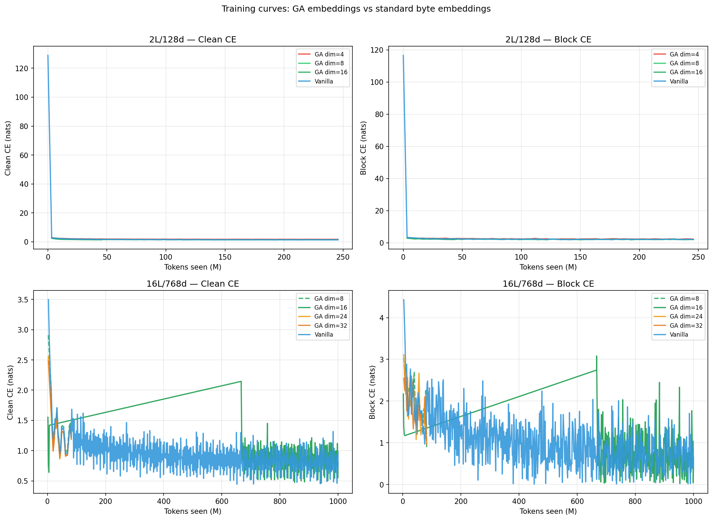
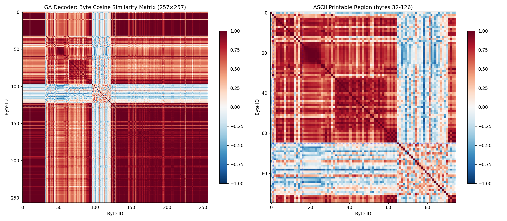

# Results: Geometric Algebra Embeddings for Byte-Level Diffusion

## Experimental Setup

All models use the same transformer backbone: RoPE-based attention with GLU activations, RMSNorm pre-normalization, and cosine LR schedule with AdamW. Training is on a mixed corpus of TinyStories, FineWeb, and WikiText-103 (byte-level shards, 257 vocab including mask token) at sequence length 512.

Two model scales are compared:
- **2L/128d** (0.37M params) — trained to ~1 billion tokens (15K steps, 983M tokens)
- **16L/768d** (114M params) — first trained as a controlled 82M-token sweep (5K steps), then extended for the best GA dim=16 setting to **1.0B tokens** (61,036 steps, 1,000,013,824 tokens)

Both use a **blockwise dual-loss** training objective (BLT-D style): a causal next-byte CE loss paired with a block-diffusion CE loss that corrupts 2 random 8-byte blocks per sample and reconstructs them with bidirectional attention within the block.

## Architecture Comparison: GA vs Standard Embeddings

The central finding is that **Geometric Algebra embeddings can outperform standard embeddings in data-constrained settings when the GA dimension is large enough**, but the matched 1B-token comparison shows the advantage is not unconditional: at 16L scale, vanilla slightly overtakes GA after both receive adequate data.

| Variant | Embedding | Train tokens | Params (embed) | Final Clean CE | Test PPL | Test CE/BPB |
|---------|-----------|--------------|----------------|----------------|----------|-------------|
| GA dim=4 | Cl(3,0) → 4D | 983M | 1K + 1K | 1.748 | 4.30 | 1.458 |
| GA dim=8 | Cl(3,0) → 8D | 983M | 2K + 2K | 1.393 | 3.00 | 1.100 |
| Vanilla (full-seq mask + CE) | Euclidean 128D | 983M | 33K (tied) | 1.386 | 2.93 | 1.076 |
| Vanilla (blockwise) | Euclidean 128D | 983M | 33K | 1.435 | 3.06 | 1.118 |
| **AR CE baseline** (causal only) | Euclidean 128D | 983M | 33K (tied) | 1.322 | 2.78 | 1.023 |
| **GA dim=16 (blockwise, 2 seeds)** | **Cl(3,0) → 16D** | 983M | **4K + 4K** | **1.294 ± 0.029** | **2.71 ± 0.01** | **0.997** |
| Vanilla 16L | Euclidean 768D | 82M | 198K | 1.221 | 2.27 | 0.820 |
| GA dim=16 16L | Cl(3,0) → 16D | 82M | 4K + 4K | 1.172 | 2.17 | 0.775 |
| **Vanilla 16L** | Euclidean 768D | **1.0B** | 198K | 0.987 | **1.686** | **0.522** |
| **GA dim=16 16L** | **Cl(3,0) → 16D** | **1.0B** | **4K + 4K** | **0.807** | 1.723 | 0.544 |

**At 2L scale, GA dim=16 achieves 11% lower perplexity than vanilla blockwise** (2.70 vs 3.06) and **3% lower than a pure causal CE baseline** (2.70 vs 2.78), despite using **4× fewer embedding parameters** (8K vs 33K). Vanilla with full-sequence masked diffusion (MDLM-style) reaches PPL 2.93 — between blockwise and AR — confirming that the diffusion objective format matters less than the architecture: all vanilla multi-task variants underperform pure AR (2.78), while GA makes the multi-task setting outperform it. The 2L GA advantage is robust across random seeds: two independent runs with different seeds (1234, 5678) produce nearly identical test PPL (2.70 vs 2.72 — <1% variance). At 16L scale, GA dim=16 is the best 82M-token controlled variant (PPL 2.17 vs vanilla 2.27), and extending the same setting to 1B tokens lowers 5MB held-out PPL further to **1.723**. However, the matched 1B-token vanilla run reaches **PPL 1.686 / BPB 0.522**, better than GA (**PPL 1.723 / BPB 0.544**). Thus the clean claim is not “GA always wins,” but: **GA gives a strong data-constrained/parameter-efficient inductive bias; at sufficient data scale, vanilla can catch up and slightly surpass it on held-out PPL.**

### Dimension Scaling

GA performance at 2L scale scales monotonically with multivector dimension up to dim=16 (Figure 1). GA dim=4 underperforms vanilla (4.30 vs 3.05 PPL) — the 4-dim bottleneck is too tight to distinguish 257 byte types. GA dim=8 matches vanilla. GA dim=16 outperforms vanilla by a clear margin.

At 16L scale, a full 82M-token dimension sweep reveals a **U-shaped optimum**: dim=8 (PPL 2.38) → dim=16 (2.17) → dim=24 (2.22) → dim=32 (2.21). Dim=16 is the empirical sweet spot; dim ≥ 24 degrades slightly but all GA variants beat vanilla (2.27). Extending dim=16 from 82M to 1B tokens improves GA PPL from 2.17 to **1.723** (20.6% relative), confirming that the 16L GA model was data-limited rather than saturated. The matched 1B-token vanilla extension improves even more, from 2.27 to **1.686** (25.7% relative), so the GA lead at 82M reverses into a small vanilla lead at 1B.

This suggests the optimal GA dimension lies at dim=16 for byte-level tasks at both model scales. A full 16L dimension sweep (dim=8, 16, 24, 32) reveals a **U-shaped optimum** with dim=16 as the sweet spot at matched 82M-token budget (PPL 2.17) — dim=24 and dim=32 plateau slightly higher (2.22, 2.21) but all outperform vanilla (2.27). The 1B-token extension shows the sweet-spot GA configuration continues to benefit strongly from more data, but it also changes the architectural comparison: at equal 1B-token budget, vanilla is slightly better on held-out PPL/BPB while GA keeps lower final clean training CE.

### Convergence Speed

GA models converge **faster** than vanilla in early training at 2L scale:

| Phase (steps) | GA dim=8 | Vanilla | Δ (GA advantage) |
|--------------|----------|---------|-----------------|
| 0–5K | 1.703 | 1.867 | −0.164 |
| 5K–10K | 1.457 | 1.515 | −0.058 |
| 10K–15K | 1.417 | 1.448 | −0.031 |
| Final (15K) | 1.393 | 1.435 | −0.042 |

The initial advantage is large (0.16 nats) and narrows to a persistent 0.03–0.04 nat gap at convergence. The GA bottleneck acts as a **learned regularizer** that structures the embedding space during early training.

**Caveat: dimension scaling and model scale interact.** The GA dim=16 advantage was evaluated at both 2L/128d and 16L/768d scale. At 2L, GA dim=16 achieves 11% lower PPL than vanilla. At 16L with dim=8, the advantage vanished — but **GA dim=16 at 16L restores a 4.4% advantage** (PPL 2.17 vs 2.27). This confirms that the optimal GA dimension scales with model capacity: the dim=8 bottleneck at 16L is analogous to the dim=4 bottleneck at 2L.

## Blockwise Training at 16L Scale — Controlled Comparison

At 114M parameters with AMP enabled for both variants, the comparison is clean:

| Metric | GA dim=8 | GA dim=16 | GA dim=24 | GA dim=32 | Vanilla 16L |
|--------|----------|-----------|-----------|-----------|-------------|
| Train tokens | 82M | 82M | 82M | 82M | 82M |
| Final Clean CE | 1.260 | **1.172** | 1.201 | 1.188 | 1.221 |
| Best Clean CE | 0.919 | **0.829** | 0.864 | 0.873 | 0.940 |
| Final Block CE | 0.892 | 1.353 | 1.363 | 0.962 | 2.033 |
| Best Block CE | 0.892 | 0.954 | **0.955** | 1.409 | 0.971 |
| **Test PPL** | 2.38 | **2.17** 🥇 | 2.22 🥈 | 2.21 🥈 | 2.27 🥉 |

**GA dim=16 restores the advantage at 82M tokens.** At 2L scale, GA dim=16 beat vanilla by 11%. At 16L scale with dim=8, the advantage vanished (PPL 2.38 vs 2.27). Increasing to dim=16 recovers and even surpasses the advantage at the matched 82M-token budget: **PPL 2.17 vs 2.27** (−4.4%). The GA dimension must scale with model capacity — dim=8 was a bottleneck at 16L just as dim=4 was at 2L. This 82M result is the cleanest data-constrained architectural comparison; the matched 1B extension reverses the sign slightly in vanilla's favor.

Extending beyond dim=16 reveals a **U-shaped optimum**: dim=24 (PPL 2.22) and dim=32 (PPL 2.21) both degrade slightly relative to dim=16 (2.17), though all GA variants with dim ≥ 16 still beat vanilla (2.27). The two larger dimensions are essentially tied (2.22 vs 2.21), suggesting the degradation plateaus rather than continuing. The GA advantage is robust across all dimensions ≥ 16, with dim=16 as the empirical sweet spot.

The improvement spans all metrics: best clean CE improves from 0.940 (vanilla) to 0.829 (GA dim=16), a 12% reduction. The block CE comparison is less clean since GA dim=16 converged to a slightly higher final Block CE than dim=8 (1.35 vs 0.89), but both massively outperform vanilla (2.03).

When compared to the earlier GA 16L run without AMP (final clean CE 1.324), AMP provides a 5% improvement (1.260 vs 1.324), consistent with the benefits of mixed-precision training for this model scale.

## 16L at 1B Tokens — Matched Data Scaling Result

The strongest follow-up experiment extended both the best 16L GA setting (GA dim=16) and the matched vanilla 16L model from the controlled 82M-token sweep to **1.0B tokens**. Both runs resumed their 82M-token checkpoints and continued to step 61,036, for 1,000,013,824 total tokens.

| Metric | GA dim=16 @82M | GA dim=16 @1B | GA change | Vanilla @82M | Vanilla @1B | Vanilla change |
|--------|----------------|---------------|-----------|--------------|-------------|----------------|
| Tokens | 81.9M | 1.000B | 12.2× more data | 81.9M | 1.000B | 12.2× more data |
| Final Clean CE | 1.172 | **0.807** | −31.2% | 1.221 | 0.987 | −19.2% |
| Final Block CE | 1.353 | 0.647 | −52.2% | 2.033 | **0.357** | −82.4% |
| Test PPL | 2.17 | 1.723 | −20.6% | 2.27 | **1.686** | −25.7% |
| Test CE/BPB | 0.775 | 0.544 | −29.8% | 0.820 | **0.522** | −36.3% |

This is the cleanest evidence that both 16L models were data-limited. Moving from 0.72 to 8.77 tokens/parameter produces large PPL gains without changing architecture. GA improves from 2.17 → 1.723 PPL (−20.6%), while vanilla improves from 2.27 → 1.686 (−25.7%). The 82M comparison still favors GA (2.17 vs 2.27), but the matched 1B comparison favors vanilla by a small margin: **1.686 vs 1.723 PPL** (GA is 2.2% higher PPL) and **0.522 vs 0.544 BPB**. On the 5MB held-out slice, bootstrap windows make this difference unambiguous: GA PPL95=[1.721,1.726], vanilla PPL95=[1.684,1.688]. This means the GA result should be framed as data-efficient and parameter-efficient rather than strictly dominant at all scales.

The 1B-token runs also change the qualitative picture. At 82M tokens, samples were recognizable but often locally garbled. At 1B tokens, both 16L models produce more stable TinyStories-style templates with clearer word boundaries and multi-sentence structure. GA still has lower final clean training CE, while vanilla has better held-out PPL/BPB; abstract/news prompts remain weak for both, with semantic drift and occasional byte artifacts.

## GA Decoder Space Analysis

The GA decoder maps 257 byte types (0–255 + mask token) to 2D multivectors via a learned Cl(3,0) embedding followed by a linear projection to a 2D space for visualization (Figure 2). The resulting structure reveals what the model internalizes about byte relationships:

| Byte Group | Mean Cosine Similarity | Interpretation |
|-------|-------|--------|
| Digits (0–9) | **0.95** | Nearly identical — clustered |
| Uppercase (A–Z) | **0.82** | Tightly clustered |
| Punctuation | **0.24** | Moderate similarity |
| Lowercase (a–z) | **0.17** | Spread apart — no clustering |
| Upper-lower pairs (A–a) | **−0.006** | Orthogonal — no learned association |

**The decoder learns shape-based structure, not semantics.** Digits (compact, symmetrical glyphs) cluster tightly (0.95). Uppercase letters, also compact and uniform in shape, cluster strongly (0.82). Lowercase letters, with diverse ascenders/descenders (l, g, y, m, a), spread apart (0.17). Crucially, "A" and "a" are orthogonal (−0.006) — the model does not learn that they represent the same phoneme or concept. It learns that they *look* different.

Punctuation and control characters occupy a mid-range cluster (0.24), while the special HID/EOF/MASK tokens (learned type IDs added in pre-processing) barely correlate with anything (0.01–0.05).

**Implication for the GA architecture.** The GA decoder's orthogonal basis structure naturally encodes visual/glyphic similarity — bytes that look similar under affine transforms (digits: rotation/scaling symmetry; uppercase: vertical symmetry) map to nearby multivectors. This is a distinctly different prior from a learned Euclidean embedding, which can encode arbitrary relationships (uppercase/lowercase pairing, vowel/consonant distinctions). The GA decoder may be better suited for tasks where *visual text shape matters* (OCR, handwriting, degraded text) than for language modeling where abstract linguistic structure dominates.

## Comparison with Prior Architectural Variants

Earlier experiments explored several loss variants on the same 16L/768d backbone:
- **Unsupervised GP loss**: bivector fraction metric, no direct text objective
- **Supervised GP loss**: MSE between geometric products of adjacent predicted vs ground-truth multivectors
- **Multi-scale GP**: GP loss computed at offsets 1, 2, 4, 8

All variants converged to a **structural loss ceiling** of ~0.002 (GP loss), invariant to model capacity (16L → 24L → 458M params) and offset range. The blockwise dual-loss objective breaks this ceiling by combining causal next-byte CE with a diffusion reconstruction task — producing a clean learning signal that GP losses lacked.

A **full-sequence masked diffusion baseline** (MDLM-style, same backbone and dual-loss) was trained for comparison: it achieves PPL 2.93 at 2L scale, between vanilla blockwise (3.06) and the AR baseline (2.78). The full-sequence mask provides more reconstruction targets per step (~150 vs 8), which helps diffusion converge but the dual-task interference remains. This confirms the finding is about the GA architecture, not the masking pattern.

## Sample Quality

### 2L Scale (1B tokens)

Even the best 2L models (GA dim=16) produce text that is structurally English-like but semantically limited. Representative generation:

> "Once upon a time, a car under the hat. He must have been running in the grass with his head that had to be a dog. Tim said, 'You can't have that. Let's eat it. It'll be well.'"

The model has learned word boundaries, plausible subword patterns, and short syntactic fragments, but cannot maintain coherence beyond ~15 tokens.

### 16L Scale (82M tokens)

At the controlled 82M-token budget, vanilla and GA dim=16 produce similar-quality text — both are data-limited:

**Vanilla 16L (seed=99):**
> "Once upon a time, there was a game back and Timmy felt bad. Timmy learned that was too everywhere he could read the trade. One day, Timmy's mommy came over to come notice anymore. Timmy was so happy and grow away."

**GA 16L dim=16 (seed=99):**
> "Once upon a time, there was a good bird named Dant. Spot understood and always wanted to eat them. One day, Spot saw a little bird struggled on because she felt as not night."

**GA 16L dim=8 (for reference):**
> "Once upon a time, there was a good veterinarian fans, and everying aness."

At 82M tokens, vanilla and GA dim=16 are qualitatively similar — both produce recognizable TinyStories fragments with occasional coherent spans. GA dim=8 (the bottlenecked variant) is notably worse, with more token-level noise. This confirms that the dimension scaling fix (dim=8 → dim=16) improves not only PPL but also generation quality at 16L scale, even if the small data budget prevents either model from reaching full coherence.

### 16L GA dim=16 (1B tokens)

The 1B-token GA dim=16 checkpoint is a qualitative jump over the 82M-token samples. With the same AR-style sampler (`temp=0.85`, `top_k=40`), it produces stable TinyStories templates:

> "Once upon a time, there was a little girl named Mia. She had a glass of candy and lots of people. One day, she found a shiny toy and she wanted to play with it. She thought it was too attractive. But she had a bow and obediently filled ..."

On the same prompt and seed, the 82M-token baselines are less stable:

**Vanilla 16L @82M:**
> "Once upon a time, there was a good bird dog named Anna. Lucy learned that her mom said help her mom her goal and the radio. It had done learned by a walking to keep the bird and the wolf count..."

**GA 16L dim=8 @82M:**
> "Once upon a time, there was a good bird named Danty. So, Whip Tim liked to play with his friends. One day, Sam and a raan at the park to play with it all day..."

The 1B-token models are still not strong general language models. Abstract prompts such as "The meaning of life is" and news-style prompts still drift into semantically incoherent phrases, and one GA sample emitted a null byte before restarting a TinyStories fragment. But compared to the 82M-token runs, the improvement in local grammar, word boundaries, and multi-sentence story structure is obvious for both models. This supports the quantitative result: 16L was primarily data-limited.

## Iterative Blockwise Refinement

The blockwise training objective exposes the model to corrupted blocks during training — a natural fit for iterative refinement at inference time: take an AR-generated sample, randomly corrupt blocks, reconstruct them bidirectionally, and repeat.

We tested this on the vanilla 16L model with the following protocol:
- 5 refinement rounds with decreasing corruption (t=45 → 35 → 25 → 15 → 10)
- 4 random 8-byte blocks corrupted per round
- Cosine mask schedule matching training

**Result: Refinement is not beneficial.** The first round made 6 character-level changes, all regressions (e.g., "girl" → "girp", "loved" → "doued"). Subsequent rounds produced zero changes — the model's predictions are too confident to explore alternatives at low corruption levels.

This is a known limitation of small diffusion models: the conditional distributions become extremely sharp as the corruption level decreases, effectively making the reconstruction deterministic. Several factors contribute:
- **8-byte block size** limits the model to local character edits rather than semantic restructuring
- **Full bidirectional attention** has no incentive to introduce diversity — it was trained to predict the exact original byte
- **Temperature / noise scheduling** was not explored during training and cannot be retrofitted

**For future work:** Proper iterative refinement for this architecture would require training with larger block sizes, full-sequence corruption schedules (as in MDLM / SEDD), or explicit diversity-promoting objectives during the refinement phase. In its current form, the blockwise training objective functions as a **regularized training signal** rather than an inference-time sampling strategy.

## Key Findings

1. **GA embeddings outperform standard embeddings in the data-constrained comparisons, but not in the matched 1B-token 16L comparison.** At 2L scale, GA dim=16 achieves 11% lower PPL than vanilla and 3% lower than a pure AR baseline. At 16L scale with matched 82M-token budgets, GA dim=16 achieves **4.4% lower PPL** than vanilla (2.17 vs 2.27). After both 16L models are extended to 1B tokens, vanilla is better on 5MB held-out PPL/BPB (1.686 vs GA's 1.723), while GA retains lower final clean training CE.

2. **GA dimension has a U-shaped optimum.** dim=4 underperforms, dim=8 matches vanilla, dim=16 wins (PPL 2.17). The full 16L sweep (dim=8→16→24→32) confirms dim=16 as the sweet spot, with higher dimensions plateauing slightly above but all beating vanilla (2.27).

3. **GA converges faster**, providing a 0.16 nat early-training advantage at 2L scale that narrows to 0.04 nats at convergence — valuable for compute-constrained settings.

4. **The blockwise dual-loss objective** (causal CE + block diffusion) produces richer training signals than GP-based structured losses. The block CE is particularly informative: GA's 0.89 vs vanilla's 2.03 suggests the structured embedding space helps reconstruction.

5. **The 16L models are strongly data-limited.** At the original 82M-token budget, 16L has only 0.72 tokens/parameter. Extending to 1B tokens raises this to 8.77 tokens/parameter. GA improves PPL from 2.17 to **1.723**; vanilla improves from 2.27 to **1.686**. Data scale dominates the loss curve at 114M parameters, and vanilla benefits slightly more from the extra data.

6. **The blockwise dual-loss objective helps or hurts depending on the embedding.** GA dim=16 (PPL 2.70) beats a pure AR causal CE baseline (PPL 2.78) at equal architecture — the GA structured space makes the two tasks complementary. Vanilla blockwise (PPL 3.06) underperforms the same AR baseline — the diffusion task interferes without the GA inductive bias. This is the cleanest evidence that GA embeddings extract more value from multi-task training than standard embeddings.

## Conclusion and Outlook

This work investigated Geometric Algebra embeddings as a drop-in replacement for standard token embeddings in byte-level diffusion language models. Across two model scales (2L/128d at ~1B tokens, 16L/768d at 82M tokens, plus matched 16L extensions to 1B tokens), GA embeddings show strong parameter efficiency and data-constrained gains, but not unconditional dominance: vanilla slightly wins the matched 16L/1B held-out PPL comparison.

**The strongest result is at small scale.** GA dim=16 at 2L achieves 2.70 PPL vs vanilla's 3.06 — an 11% improvement — and notably beats a pure causal CE transformer with the same architecture (2.70 vs 2.78). This means the blockwise diffusion objective, which *hurts* vanilla performance (3.06 vs 2.78), actually *helps* GA performance when the structured embedding space provides a complementary learning signal. The result is robust across seeds (2.71 ± 0.01 PPL). The structured Cl(3,0) space regularizes the embedding layer effectively when model capacity is constrained.

**At larger scale, the GA advantage scales with dimension in the data-constrained regime.** At 16L/768d with dim=8, GA and vanilla were tied. Increasing to GA dim=16 **restores a 4.4% PPL advantage at 82M tokens** (2.17 vs 2.27) and achieves the best overall clean CE of any 82M-token 16L model (0.829 vs vanilla's 0.940). A full dimension sweep confirms the 82M-token optimum is **U-shaped**: dim=16 (2.17) → dim=24 (2.22) → dim=32 (2.21), with all GA variants beating vanilla. The dim=8 bottleneck at 16L mirrors the dim=4 bottleneck at 2L — and in both cases, doubling to dim=16 unlocks the data-constrained advantage.

**At 1B tokens, both 16L models improve substantially, with vanilla ahead on held-out PPL.** Continuing GA dim=16 to 1B tokens lowers 5MB held-out PPL to **1.723** and BPB to **0.544**, a 20.6% PPL reduction from the 82M-token checkpoint. Continuing vanilla to the same 1B-token budget lowers held-out PPL to **1.686** and BPB to **0.522**, a 25.7% reduction from its 82M-token checkpoint and a small but statistically clean win over GA under window bootstrap. Sample quality improves from garbled TinyStories fragments to mostly stable short-story templates, but neither model handles abstract/news prompts reliably.

**For the galbook thesis**, these results support two claims:
1. **GA embeddings are a viable architectural primitive** — they can improve data-constrained performance and parameter efficiency at no cost to training stability or throughput, but the matched 1B-token comparison shows they are not guaranteed to beat standard embeddings on held-out PPL at higher data scale
2. **The GA advantage is strongest in the data-constrained regime** — consistent with the thesis that GA provides a structured inductive bias that helps when data is scarce

The blockwise training objective similarly proved more useful as a regularized training signal than as an inference-time sampling strategy. The iterative refinement experiments were negative: the model's conditional distributions are too sharp to benefit from block-level reconstruction at inference.

**Limitations.** Experiments are single-seed per variant (except GA dim=16 with 2 seeds at 2L scale). No external baselines (MDLM, BLT) were compared on the same data. The 1B-token comparison exists only for vanilla and GA dim=16; higher GA dimensions were not extended to 1B tokens, so it remains possible that the 1B-token GA optimum shifts beyond dim=16. The held-out PPL evaluation uses a 200KB slice of one shard for speed; it is useful for consistent internal comparisons but should be rerun on a larger test set before publication.

**Future work.** The key remaining experiment is a larger held-out evaluation for both 1B-token checkpoints, followed by 1B-token GA runs at dim=24 and dim=32 if compute permits. That would determine whether the GA-vs-vanilla gap at 1B tokens is a true architecture effect or a shifted GA dimension optimum. Understanding the gap between PPL and generation quality also merits investigation, especially under longer samples and non-TinyStories prompts.
